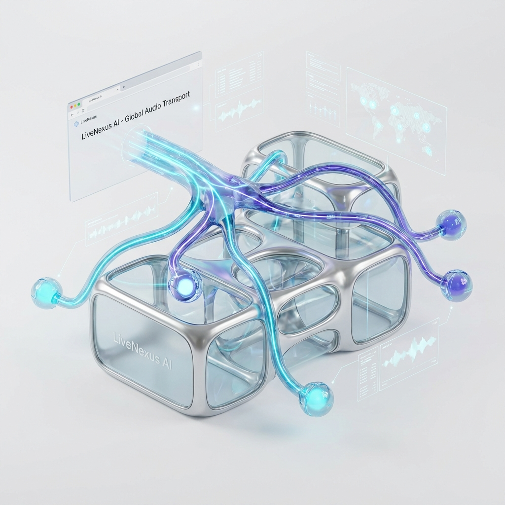

# LiveNexus AI



## Real-Time Hybrid Audio Intelligence Platform

<div align="center">


</div>

**LiveNexus AI** is a real-time speech intelligence system. It demonstrates how to achieve **<200ms Latency Transcription** on standard CPU hardware by combining **WebRTC Transport (LiveKit)** with optimized **Edge Inference (Faster-Whisper + VAD)**.

---

## 🚀 Quick Start

Get the system running in 2 steps:

```bash
# 1. Start Frontend (UI)
npm install && npm run dev

# 2. Start AI Worker (Deep Learning)
cd ai-worker && docker build -t worker . && docker run --env-file ../.env.local worker
```

> **Detailed Setup**: See [GETTING_STARTED.md](./docs/GETTING_STARTED.md) for API Keys.

---

## 📸 Demo & Architecture

### System Architecture

*WebRTC Client -> LiveKit Cloud -> Python Worker (VAD + Whisper)*

### Real-Time Pipeline

*Audio In -> VAD Filter -> Inference -> DataChannel Out*

### Features Overview

*Double-Buffer UI, CPU Optimization, and Binary Transport*

> **Deep Dive**: See [ARCHITECTURE.md](./docs/ARCHITECTURE.md) for the VAD Gating logic.

---

## ✨ Key Features

*   **⚡ <200ms Latency**: Optimized quantized models run faster than cloud APIs.
*   **🔇 VAD Gating**: `webrtcvad` drops 70% of silence packets, saving massive CPU.
*   **🧠 Resource Intelligence**: Automatically downgrades model size if CPU > 80%.
*   **🔄 Zero-Stutter UI**: "Double-Buffer" rendering strategy for smooth text updates.

---

## 📚 Documentation

| Document | Description |
| :--- | :--- |
| [**System Architecture**](./docs/ARCHITECTURE.md) | Hybrid Cloud/Edge design and VAD Pipeline. |
| [**Getting Started**](./docs/GETTING_STARTED.md) | Connect to LiveKit and run Docker worker. |
| [**Failure Scenarios**](./docs/FAILURE_SCENARIOS.md) | Handling High CPU and Network Jitter. |
| [**Interview Q&A**](./docs/INTERVIEW_QA.md) | "Why not OpenAI API?" and "WebSockets vs DataChannels". |

---

## 🔧 Tech Stack

| Component | Technology | Role |
| :--- | :--- | :--- |
| **Transport** | **LiveKit (WebRTC)** | SFU & Signaling. |
| **Inference** | **Faster-Whisper** | Quantized Speech-to-Text. |
| **Filter** | **WebRTCVAD** | Voice Activity Detection. |
| **Frontend** | **Next.js 14** | Real-time UI. |

---

## 👤 Author

**Harshan Aiyappa**  
Senior Full-Stack Hybrid Engineer  
[GitHub Profile](https://github.com/Kimosabey)

---

## 📝 License

This project is licensed under the MIT License - see the [LICENSE](LICENSE) file for details.
