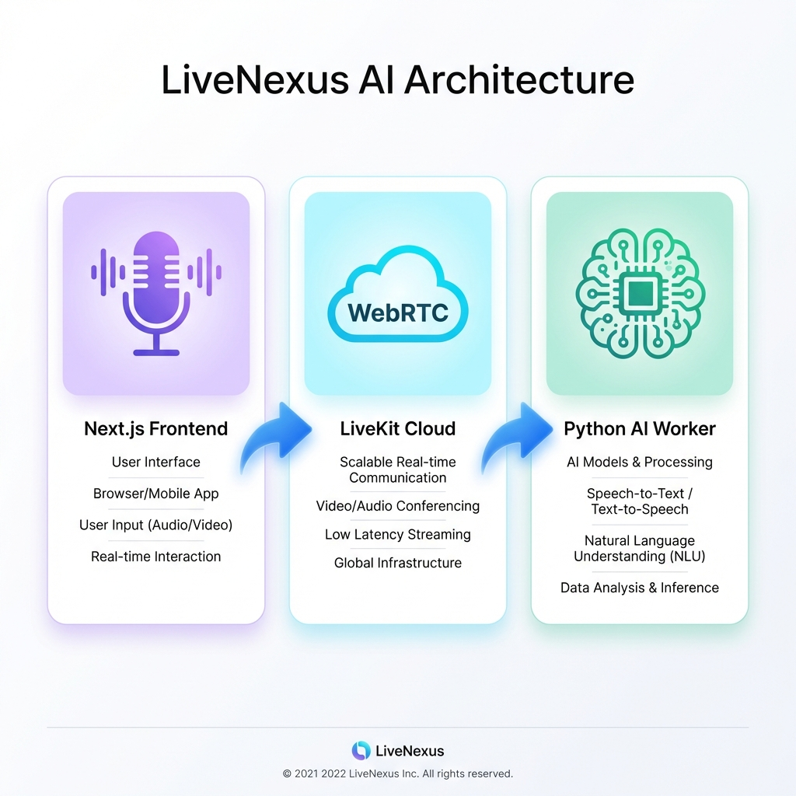
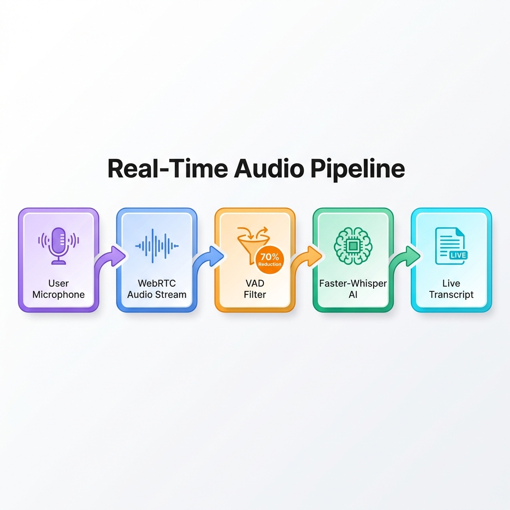
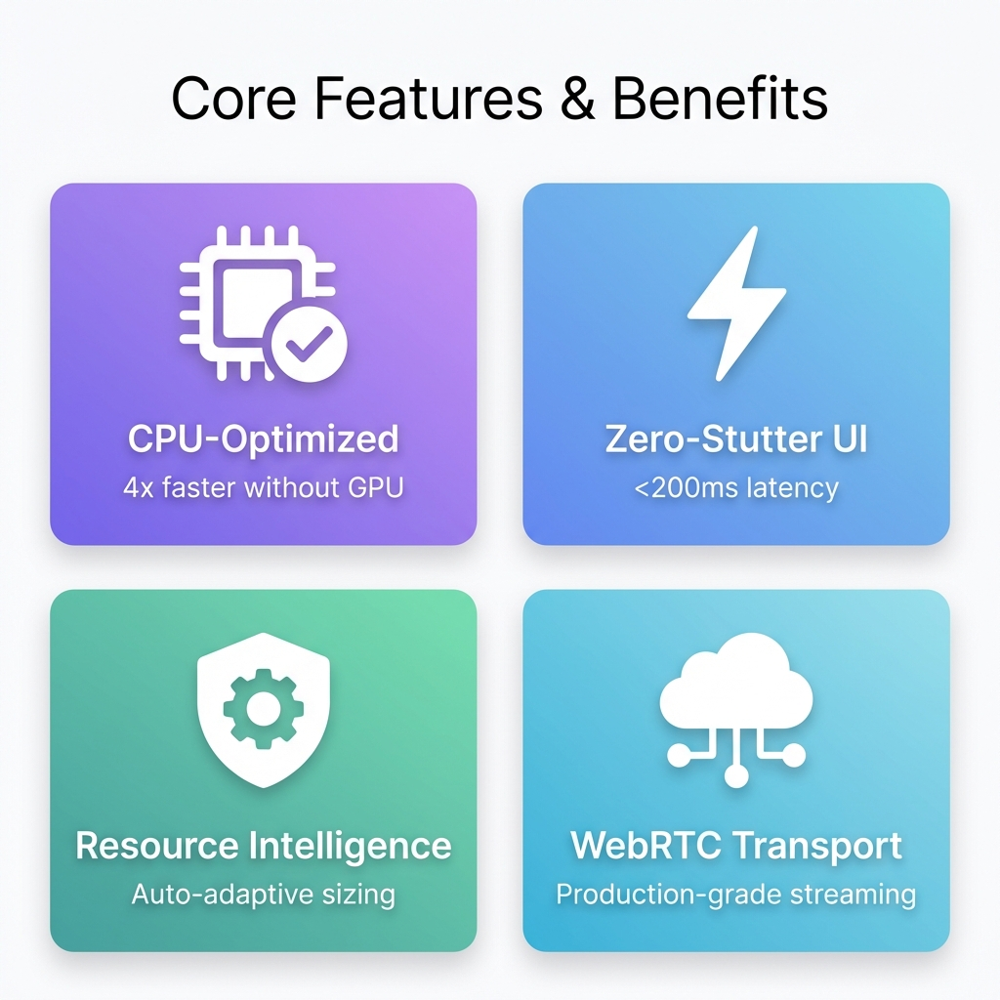
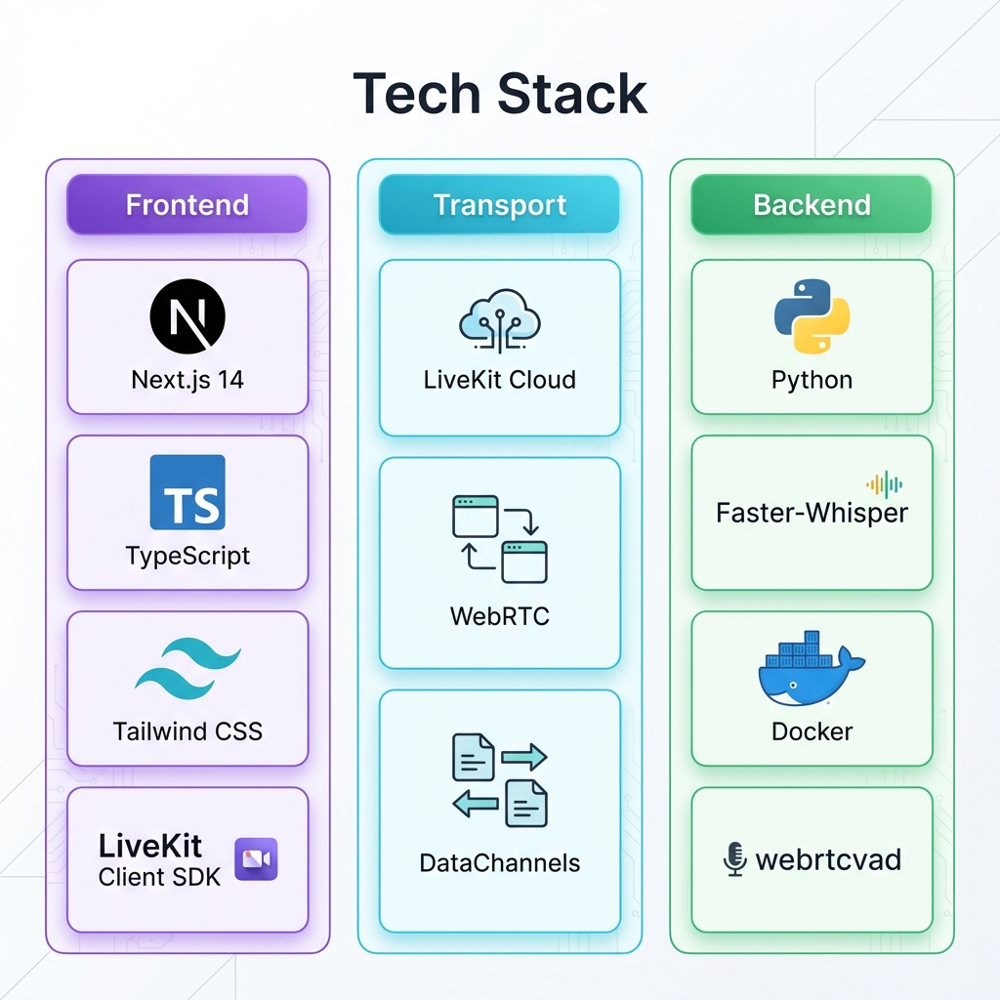
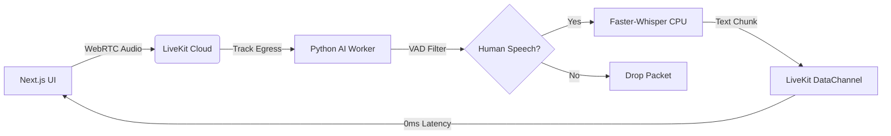

# LiveNexus AI

> **Real-Time Hybrid Audio Intelligence Platform**  
> CPU-Optimized Inference + Cloud Transport Architecture

[]()
[]()
[]()
[]()

---

## 📋 Quick Start

### Prerequisites
- **Node.js** 18+ and npm
- **Python** 3.10+
- **Docker** (for AI worker)
- **LiveKit Cloud** account ([Get free tier](https://cloud.livekit.io))

### 1. Clone and Install

```bash
git clone https://github.com/Kimosabey/live-nexus-ai.git
cd live-nexus-ai
npm install
```

### 2. Configure LiveKit

Create `.env.local` in the project root:

```bash
LIVEKIT_API_KEY=your_api_key_here
LIVEKIT_API_SECRET=your_api_secret_here
LIVEKIT_URL=wss://your-project.livekit.cloud
```

> Get credentials from [LiveKit Cloud Dashboard](https://cloud.livekit.io/projects)

### 3. Run the Frontend

```bash
npm run dev
```

Open [http://localhost:3000](http://localhost:3000)

### 4. Run the AI Worker (Docker)

```bash
cd ai-worker
docker build -t livenexus-worker .
docker run --env-file ../.env.local livenexus-worker
```

---

## 📸 Screenshots

### System Architecture


### Real-Time Audio Pipeline


### Core Features & Benefits


### Technology Stack


---

## 🎯 Key Features

### Phase 1 (Current)
- ✅ **LiveKit Integration**: WebRTC audio streaming with cloud SFU
- ✅ **Stealth UI Design**: Pure black background, silver text, Space Grotesk font
- ✅ **Real-Time Connection**: Join/disconnect from LiveKit rooms
- ✅ **Python Worker Shell**: Connects as AI agent and logs audio reception
- ✅ **Double-Buffer Architecture**: Separate UI for partial/final transcripts

### Upcoming Phases
- 🔄 **VAD Gating** (Phase 2): webrtcvad for 70% load reduction
- 🔄 **Faster-Whisper** (Phase 2): CPU-optimized speech-to-text
- 🔄 **Live Transcription** (Phase 3): Real-time text rendering with zero stutter
- 🔄 **Resource Intelligence** (Phase 4): Auto-downgrade model at 80% CPU
- 🔄 **Production Optimization** (Phase 5): Deployment guides and monitoring

---

## 🏗️ Architecture

### System Flow



### Layer Breakdown

| Layer | Technology | Purpose |
|-------|-----------|---------|
| **Frontend** | Next.js 14 + LiveKit Client SDK | Audio capture, transcript rendering |
| **Transport** | LiveKit Cloud (Free Tier) | WebRTC SFU, signaling, DataChannels |
| **AI Engine** | Python + Faster-Whisper | CPU-optimized speech-to-text |
| **VAD** | webrtcvad | Voice activity detection (70% load savings) |

### Performance Targets

- **Latency**: <200ms (audio → transcript → UI)
- **CPU Usage**: <60% average on i5 processors
- **Memory**: <16GB with base Whisper model
- **Throughput**: 5min continuous speech without degradation

---

## 🧪 Testing & Scripts

### Development

```bash
# Frontend dev server
npm run dev

# Build for production
npm run build

# Start production server
npm start

# Lint code
npm run lint
```

### Worker Testing

```bash
# Build Docker image
cd ai-worker
docker build -t livenexus-worker .

# Run with environment variables
docker run --env-file ../.env.local livenexus-worker

# Check logs
docker logs <container_id>
```

### Manual Testing Checklist

1. ✅ Connect to LiveKit room
2. ✅ Allow microphone access
3. ✅ Verify worker logs show "Audio Received"
4. ✅ Check browser console for connection status
5. 🔄 Speak and verify transcripts (Phase 2)

---

## 📚 Documentation

### Project Structure

```
live-nexus-ai/
├── app/                       # Next.js 14 App Router
│   ├── api/livekit-token/    # JWT token generation
│   ├── layout.tsx            # Root layout + SEO
│   ├── page.tsx              # Main UI
│   └── globals.css           # Stealth design system
├── components/               # React components
│   ├── ConnectButton.tsx     # LiveKit room connector
│   └── TranscriptView.tsx    # Double-buffer transcripts
├── ai-worker/                # Python AI Worker
│   ├── Dockerfile            # Container definition
│   ├── main.py              # Worker logic
│   └── requirements.txt      # Python dependencies
├── .env.example             # Environment template
└── README.md                # This file
```

### Senior Signals Implemented

1. **Zero-Stutter UI**: Separate React state for partial vs final transcripts
2. **Resource Intelligence**: Auto-downgrade Whisper model at 80% CPU (Phase 4)
3. **Binary Transport**: LiveKit DataChannels (not WebSockets)
4. **VAD Gating**: Only process human speech packets (Phase 2)

### Design System (Tab 13 - Stealth)

- **Background**: Pure Black (`#000000`)
- **Text**: Silver (`#C0C0C0`)
- **Accent**: Cyan (`#00D9FF`)
- **Typography**: Space Grotesk (Google Fonts)
- **Animation**: Subtle pulse effects for active states

---

## 🛠️ Tech Stack

### Frontend
- **Framework**: Next.js 14 (App Router)
- **Language**: TypeScript
- **Styling**: Tailwind CSS
- **WebRTC**: LiveKit Client SDK
- **Fonts**: Space Grotesk

### Backend
- **Runtime**: Python 3.10
- **AI**: Faster-Whisper (CTranslate2)
- **VAD**: webrtcvad
- **Async**: asyncio
- **Container**: Docker

### Infrastructure
- **Transport**: LiveKit Cloud (Free Tier)
- **Signaling**: WebRTC SFU
- **Data**: LiveKit DataChannels

---

## 🚀 Future Enhancements

### Phase 2: AI Integration (Week 2)
- [ ] Integrate webrtcvad for voice activity detection
- [ ] Add Faster-Whisper inference pipeline
- [ ] Implement audio format conversion (LiveKit → Whisper)
- [ ] Test latency with different Whisper model sizes

### Phase 3: UI Polish (Week 3)
- [ ] Implement double-buffer transcript rendering
- [ ] Add timestamp formatting
- [ ] Create export functionality (JSON, TXT)
- [ ] Add error boundary components

### Phase 4: Resource Management (Week 4)
- [ ] CPU usage monitoring
- [ ] Auto-downgrade Whisper model logic
- [ ] Memory leak prevention
- [ ] Connection recovery logic

### Phase 5: Production Ready (Week 5)
- [ ] Add authentication layer
- [ ] Implement room-based isolation
- [ ] Create deployment guides (Docker Compose)
- [ ] Add telemetry and monitoring
- [ ] Write integration tests

---

## 📄 License

MIT License - see [LICENSE](LICENSE) for details

---

## 👤 Author

**Harshan Aiyappa ** - Senior Hybrid Engineer  
Building Silicon Valley-grade AI platforms on consumer hardware

---

## 🎓 Learning Outcomes

This project demonstrates:
- **Real-Time Architecture**: WebRTC, SFU patterns, DataChannels
- **CPU-Optimized AI**: Running inference without GPU
- **Resource-Aware Design**: Adaptive model sizing, VAD filtering
- **Modern React**: Server Components, Suspense, TypeScript
- **Production Patterns**: Error handling, logging, monitoring

**Built with Antigravity Mode™** - Proving senior engineering is about architecture, not hardware.
